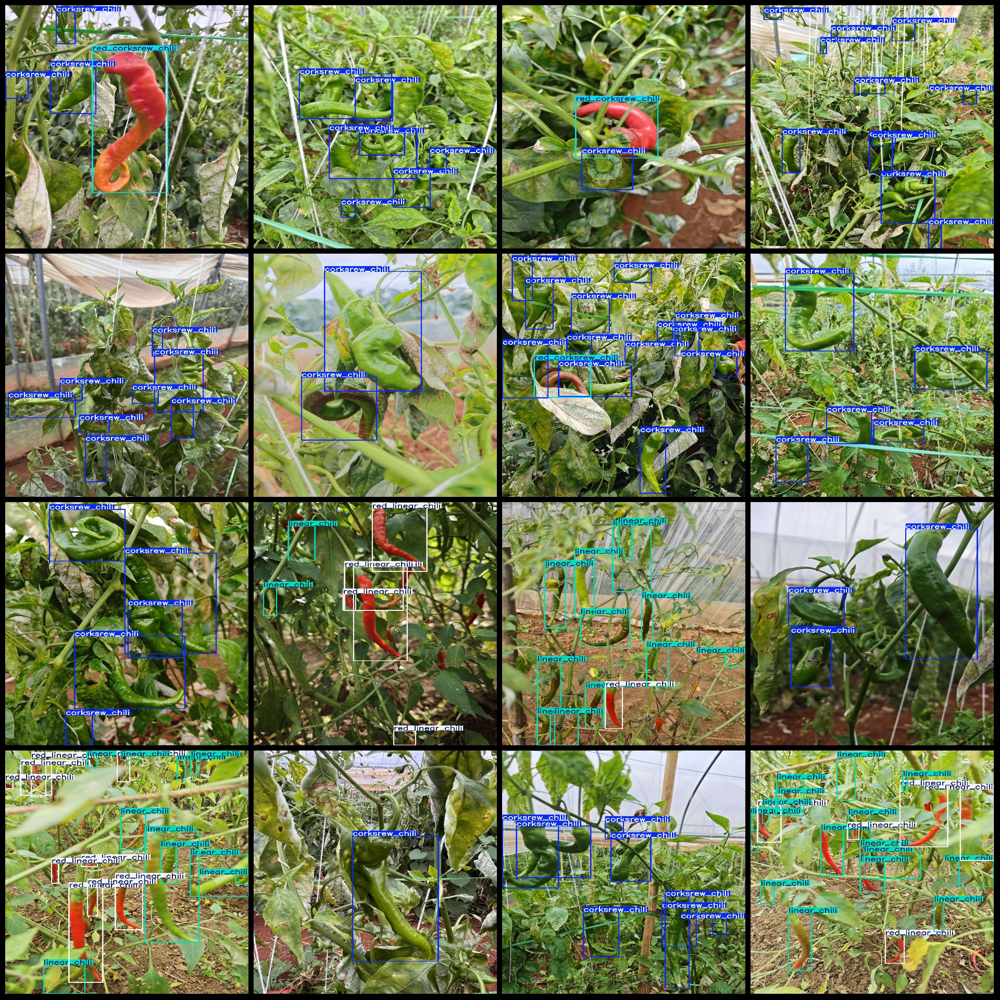
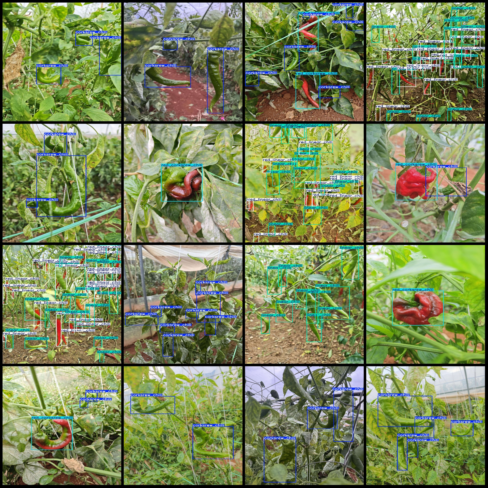

# Smart Agriculture Different Varieties and Chili Type Detection Dataset VOC+YOLO Format with 1086 Images in 4 Categories

Dataset format: Pascal VOC format + YOLO format (txt files without split paths, only containing jpg images along with corresponding VOC format xml files and YOLO format txt files)
Number of images (jpg file count): 1086
Number of annotations (xml file count): 1086
Number of annotations (txt file count): 1086
Number of annotation categories: 4
Annotation category names (note that the order of categories in the YOLO format does not correspond to this, but is based on the classes.txt file in the labels folder): ["corksrew_chili", 
"linear_chili", "red_corksrew_chili", "red_linear_chili"]
Number of boxes per category:
- corksrew_chili (spiral chili) = 2041
- linear_chili (line chili) = 4833
- red_corksrew_chili (red spiral chili) = 336
- red_linear_chili (red line chili) = 2832
Total box count: 10042
Image resolution: 1920x2560
Annotation tool used: labelImg
Annotation rules: draw a rectangle around each category
Important note: The dataset does not have been split into training, validation, or test sets; you need to do so yourself.
Special declaration: This dataset does not guarantee any accuracy for models trained on it or any weights files.
Image preview:

## Images

Here is a pay link on Stripe ( https://buy.stripe.com/3cs8yP7sY87d0vu9AB ). Please contact me lonlonago@foxmail.com after funding $89, and I will send you a complete data files , thank you!

